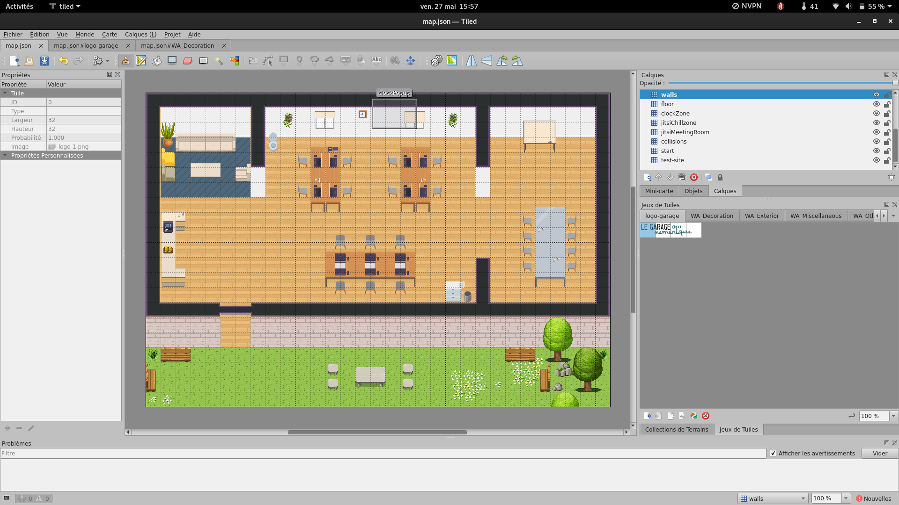
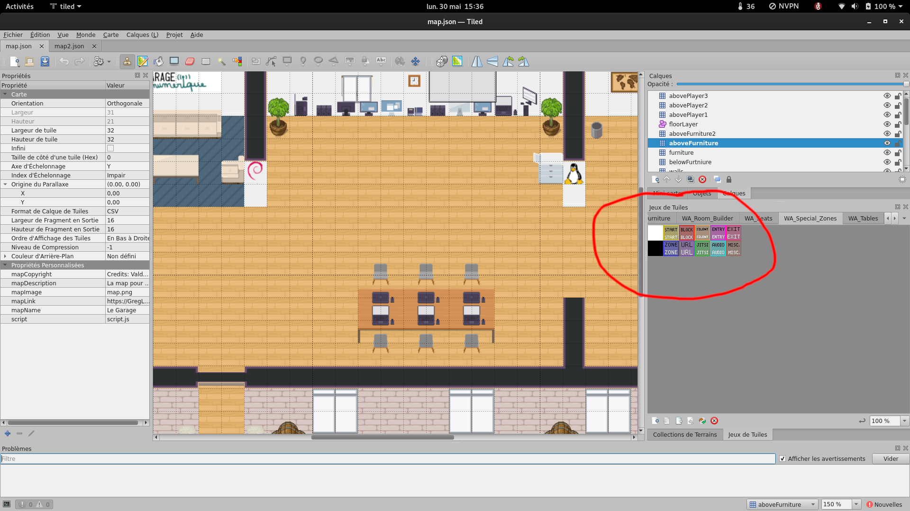
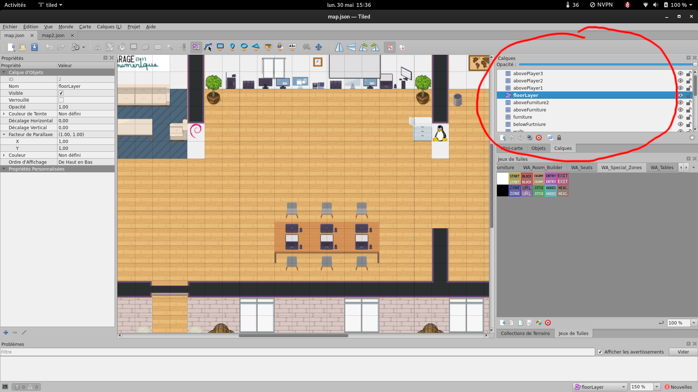
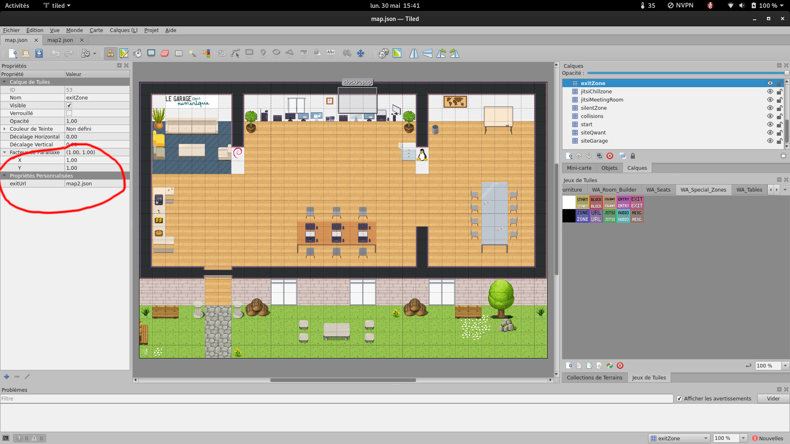
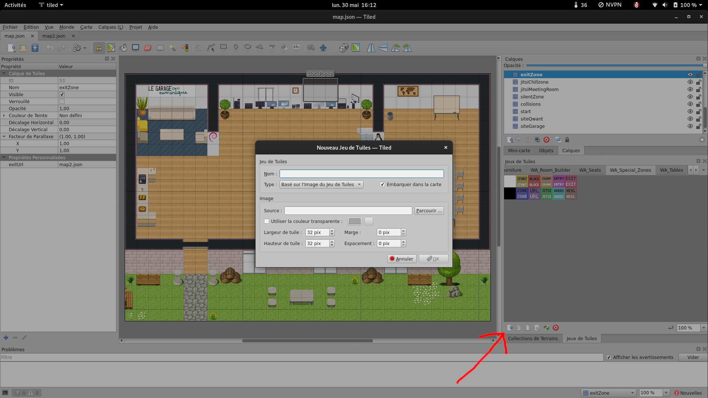

# WorkAdventure Map Starter Kit
# GARAGE MAP



This is a starter kit to help you build your own map for [WorkAdventure](https://workadventu.re).

To understand how to use this starter kit, follow the tutorial at [https://workadventu.re/map-building](https://workadventu.re/map-building).

## Pré requis

- Tiled (https://www.mapeditor.org/)

- npm (comes with [node](https://nodejs.org/en/))

```bash
sudo apt install npm -y
```

## Installation

- Ouvrir un terminal et copier les commandes suivantes:

```bash
git clone https://github.com/GregLebreton/adventure-map.git
cd adventure-map
./install
source ~/.bashrc
```

- Pour démarrer Tiled, entrer la commande suivante dans le terminal:
```
tiled
```

### Installation de Tiled (éditeur de map)

```bash
npm install
npm run start
```

Le navigateur s'ouvre, choisir "tester la map"

- A chaque modification sur la map, enregistrer (ctrl+s) et recharger la page du navigateur.

## Blocs

Les blocs (ou tiles pour tuile en anglais) vont afficher les textures choisies dans les jeux de tuiles sur la map.
Un bloc est toujours rattaché à une layer d'affichage.
- Les blocs spéciaux permettent de créer des intéractions sur les tuiles.



- start: Zone de spawn (départ) du woka (personnage) lors de la connexion.
- block: Collider qui va physiquement créer les murs (empécher le woka de traverser les murs)
- silent: Zone de silence qui bloquera les bulles de discution entre deux personnes
- entry: Todo
- exit: Zone permettant de définir une sortie vers une autre map
- zone: Todo
- url: Zone qui fera apparaitre une fenêtre d'un site web (à configurer dans les propriété du bloc)
- jitsi: Zone permettant de créer une visio conférence Jitsi
- audio: Zone lançant une musique configurée dans les propriétés du bloc
- misc: Todo


## Layers

Les layers déterminent sur quelle profondeur s'affiche les tuiles.
La hiérarchie des layers est la suivante:
- La layer la plus en bas est derrière toutes les autres au dessus d'elle.
- La layer la plus en haut s'affiche devant toutes les autres.



## Propriétés personnalisées

Il est possible d'ajouter des propriétés aux tuiles.
exemple: Pour un bloc spécial "EXIT", il faudrat ajouter une propriété "exitUrl" de type string ou serat renseigner l'url de la map vers laquelle le bloc exit envoie.



## Ajout de tileset (jeu de tuiles)

Pour ajouter des jeux de tuiles, il faut:
- Ajouter l'image du jeu de tuile dans le dossier src/assets/
- Importer via l'interface de Tiled dans la fenêtre à droite "jeux de Tuiles"
- Cliquer sur l'icone "Nouveau Jeu de Tuiles"

:warning: Une fois l'image ajouté dans src/assets et dans l'interface de la map dans Tiled, ne pas modifier son nom.



Enfin, dans la fenêtre contextuelle, entrer un nom pour le nouveau jeu de tuiles et naviguer jusqu'à l'image du jeu de tuile, puis cliquer sur OK

## Ressources

- https://opengameart.org/

## Licenses

This project contains multiple licenses as follows:

* [Code license](./LICENSE.code) *(all files except those for other licenses)*
* [Map license](./LICENSE.map) *(`map.json` and the map visual as well)*
* [Assets license](./LICENSE.assets) *(the files inside the `src/assets/` folder)*

### About third party assets

If you add third party assets in your map, do not forget to:
1. Credit the author and license with the "tilesetCopyright" property present in the properties of each tilesets in the `map.json` file
2. Add the license text in LICENSE.assets
